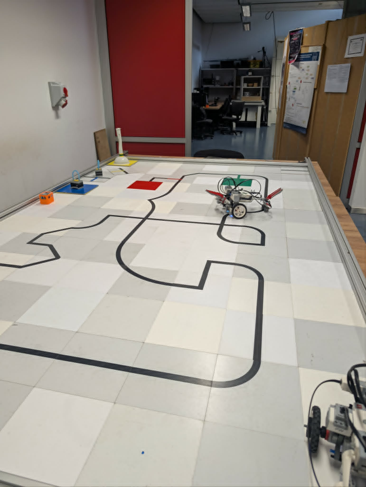
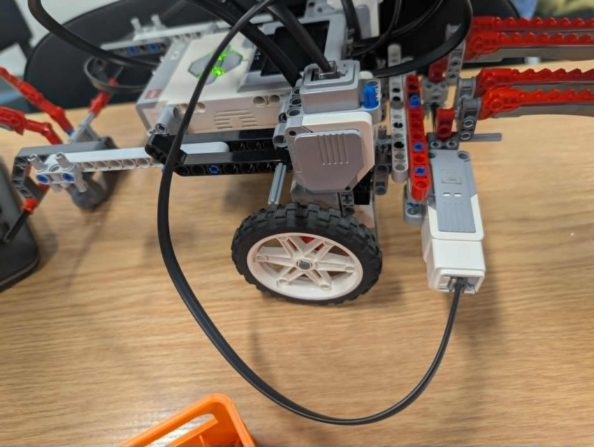
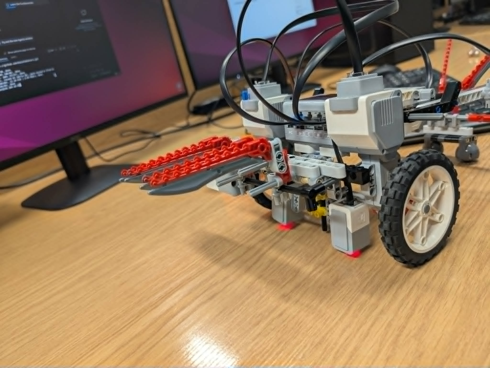
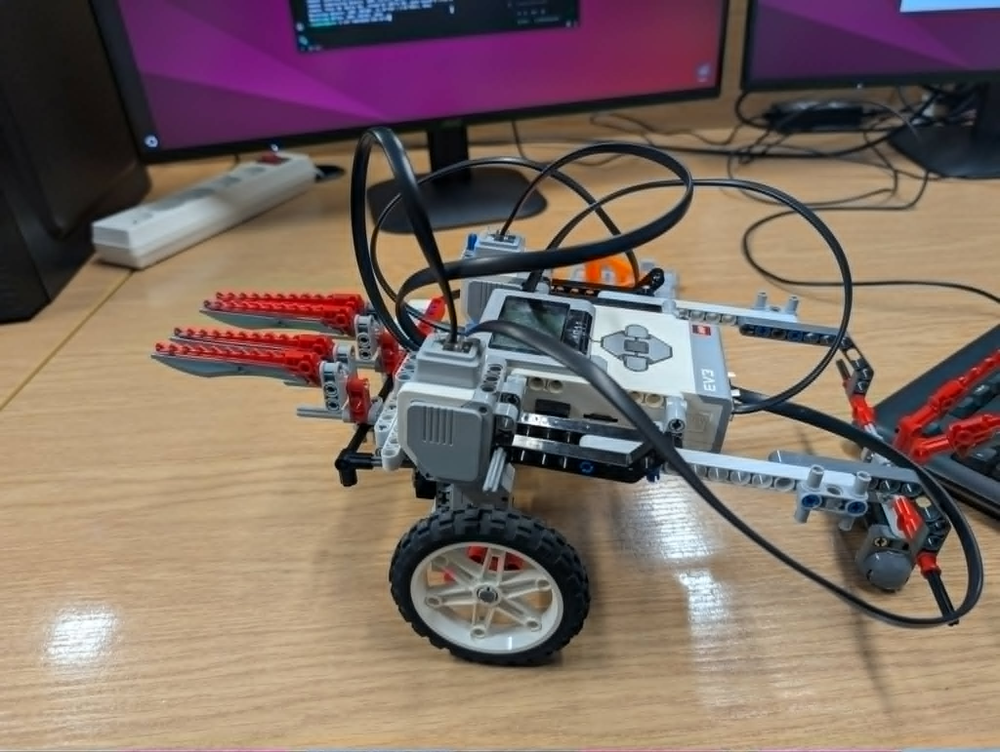
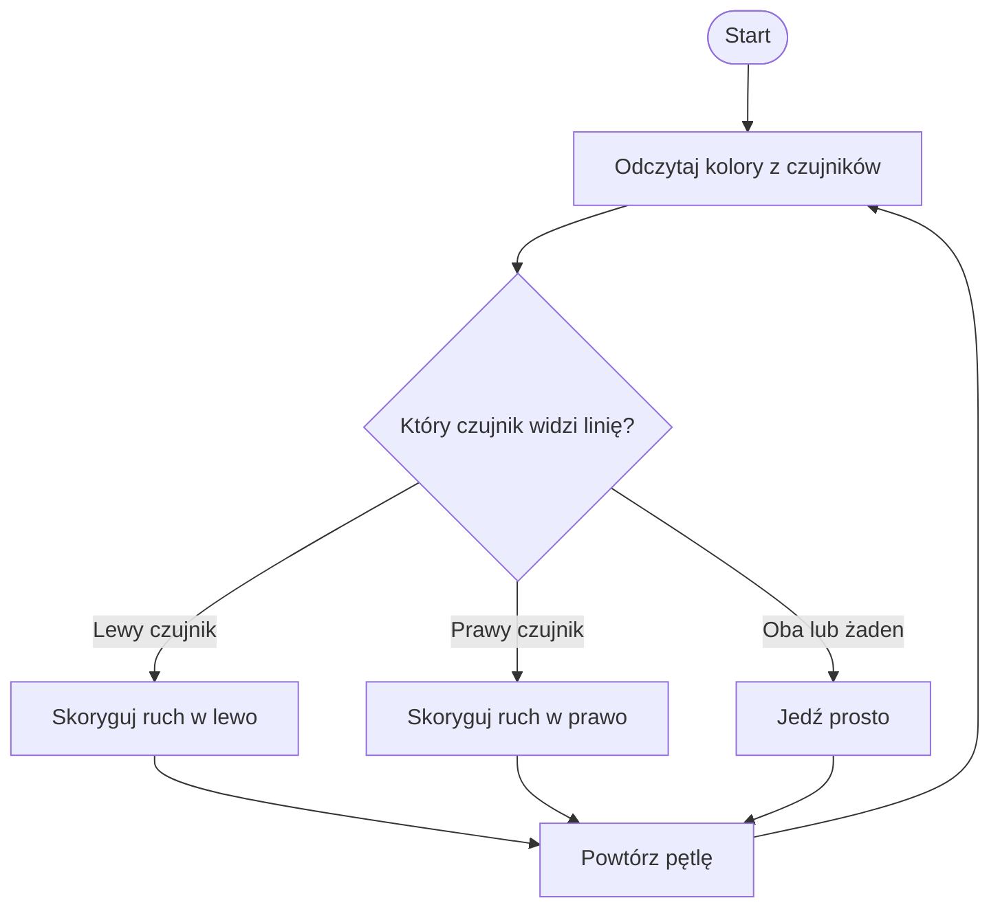
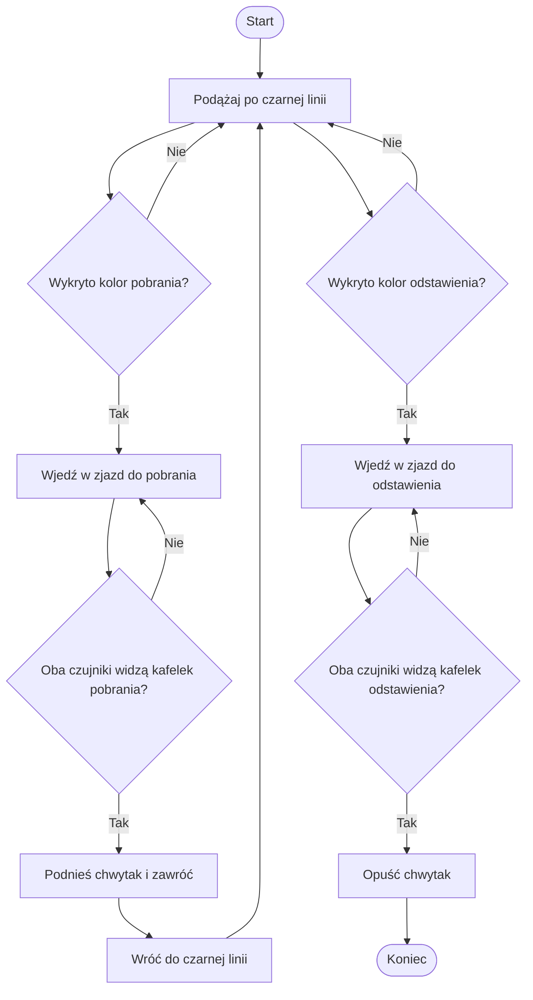

# Dokumentacja robota - Linefollower i Transporter

## 1. Informacje o projekcie

### 1.1. Skład zespołu

- Rafał Mironko
- Maciej Kozłowski

### 1.2. Link do repozytorium

Repozytorium z kodem robota: https://github.com/koziolek24/wri

### 1.3. Zakres dokumentacji

Dokumentacja opisuje konstrukcję oraz oprogramowanie robota przygotowanego do realizacji dwóch zadań laboratoryjnych:

- podążanie wzdłuż linii,
- transport obiektu między kolorowymi kafelkami planszy.

Robot został wykonany z elementów LEGO Mindstorms EV3. Do jazdy wykorzystuje napęd różnicowy oparty o dwa silniki napędowe oraz dwa duże koła. Do wykrywania trasy i kolorowych zjazdów używa dwóch czujników koloru zamontowanych z przodu robota. Do realizacji zadania transportera wykorzystuje mechanizm chwytaka sterowany osobnym silnikiem średnim.

W dokumentacji opisano konstrukcję, sposób wykrywania kolorów, strukturę programu, algorytm jazdy po linii, algorytm transportu obiektu oraz problemy napotkane podczas budowy i testowania robota.

## 2. Opis konstrukcji robota

### 2.1. Baza jezdna

Robot ma klasyczną bazę jezdną zbudowaną z elementów LEGO Technic oraz kontrolera EV3. Konstrukcja jest oparta o dwa duże koła napędowe umieszczone po bokach robota. Z tyłu znajduje się podpora stabilizująca złożona z dwóch elementów z metalową kulką, która pozwala utrzymać robota w poziomie i zmniejsza tarcie podczas skręcania.

Taki układ pozwala robotowi skręcać różnicowo, czyli przez ustawianie różnych prędkości dla lewego i prawego silnika. Dzięki temu robot może wykonywać zarówno łagodne korekty toru jazdy, jak i mocniejsze skręty używane podczas wjazdu w kolorowe odnogi.

Konstrukcja robota jest dość długa, ponieważ z przodu znajduje się wysunięty chwytak. Wpływa to na sposób skręcania, ponieważ przednia część robota wcześniej dojeżdża do rozjazdów i kolorowych pól niż oś kół. Jednocześnie daje to korzystne ustawienie czujników koloru, które mogą wykryć linię lub zjazd zanim robot całym korpusem znajdzie się na zakręcie.

### 2.2. Napęd

Do napędu użyto dwóch silników podłączonych do portów `OUTPUT_A` oraz `OUTPUT_B`. Silniki są sterowane przez obiekt `MoveTank` z biblioteki `ev3dev2`, co pozwala niezależnie ustawiać prędkość lewej i prawej strony robota.

Program definiuje kilka gotowych typów ruchu:

| Ruch         | Prędkość lewej strony | Prędkość prawej strony | Zastosowanie            |
| ------------ | --------------------: | ---------------------: | ----------------------- |
| `forward`    |                    15 |                     15 | Jazda prosto            |
| `backward`   |                   -15 |                    -15 | Jazda do tyłu           |
| `soft_left`  |                   -28 |                     12 | Korekta w lewo          |
| `soft_right` |                    12 |                    -28 | Korekta w prawo         |
| `hard_left`  |                   -35 |                     20 | Mocny skręt w lewo      |
| `hard_right` |                    20 |                    -35 | Mocny skręt w prawo     |
| `spin_left`  |                   -30 |                     30 | Obrót w miejscu w lewo  |
| `spin_right` |                    30 |                    -30 | Obrót w miejscu w prawo |

Niskie prędkości jazdy prosto zostały dobrane tak, aby robot nie wypadał z trasy i miał czas na reakcję po zmianie odczytu z czujników. Mocniejsze skręty są używane tylko w wybranych momentach, na przykład przy wjeździe w kolorową odnogę albo podczas zawracania po pobraniu obiektu.

### 2.3. Koła i stabilizacja

Robot wykorzystuje dwa duże koła LEGO z gumowymi oponami. Duży rozmiar kół pozwala uzyskać stabilną jazdę i dobrą przyczepność na planszy. Jednocześnie większe koła powodują, że robot reaguje dość szybko nawet przy niewielkich prędkościach silników, dlatego w programie zastosowano ograniczone wartości prędkości.

Z tyłu konstrukcji znajduje się element podporowy. Jego zadaniem jest stabilizacja robota i utrzymywanie odpowiedniego kąta względem powierzchni planszy. Ma to znaczenie szczególnie przy działaniu chwytaka, ponieważ podnoszenie lub opuszczanie przedmiotu zmienia obciążenie przedniej części konstrukcji.

### 2.4. Czujniki koloru

Robot wykorzystuje dwa czujniki koloru EV3. Lewy czujnik jest podłączony do portu `INPUT_2`, a prawy czujnik do portu `INPUT_1`.

Czujniki są zamontowane nisko przy przedniej części robota, blisko powierzchni planszy. Ich położenie pozwala na:

- wykrywanie czarnej linii głównej,
- wykrywanie kolorowych zjazdów,
- rozpoznawanie, po której stronie robota znajduje się kolorowa odnoga,
- sprawdzenie, czy robot wjechał całkowicie na kolorowy kafelek.

Dwa czujniki umożliwiają prostą ocenę położenia robota względem linii. Gdy jeden czujnik widzi linię, a drugi jej nie widzi, program wykonuje korektę toru jazdy. Gdy robot znajduje kolorowy zjazd tylko jednym czujnikiem, program rozpoznaje stronę zjazdu i wykonuje skręt w odpowiednim kierunku.

### 2.5. Mechanizm chwytaka

Z przodu robota znajduje się wysunięty mechanizm chwytaka wykonany z elementów LEGO Technic. Chwytak ma formę dwóch długich, równoległych ramion, które pozwalają pobrać i przetransportować niewielki obiekt manipulacji.

Chwytak jest sterowany silnikiem średnim podłączonym do portu `OUTPUT_D`. W programie obsługują go dwie procedury:

- `move_grabber_up_to_limit` - podniesienie chwytaka podczas pobierania obiektu,
- `move_grabber_down_to_limit` - opuszczenie chwytaka podczas odstawiania obiektu.

Sterowanie chwytakiem jest czasowe. Oznacza to, że silnik działa przez z góry ustawiony czas, a następnie zostaje wyłączony. Takie rozwiązanie jest proste i wystarczające dla zadania, ponieważ mechanizm wykonuje zawsze taki sam ruch: podniesienie przy pobraniu oraz opuszczenie przy odstawieniu.

### 2.6. Zdjęcia konstrukcji

Poniższe zdjęcia pokazują planszę testową oraz konstrukcję robota.

_Rys. 1. Plansza testowa z czarną linią, kolorowymi kafelkami oraz robotem wykonującym przejazd._

_Rys. 2. Widok boczny robota z widocznym kołem napędowym, czujnikiem koloru oraz wysuniętym mechanizmem chwytaka._

_Rys. 3. Widok przedniej części robota z mechanizmem chwytaka i nisko zamontowanymi czujnikami koloru._

_Rys. 4. Widok z góry i boku pokazujący rozmieszczenie kontrolera EV3, silników, przewodów oraz elementów konstrukcyjnych._

## 3. Opis sprzętu i konfiguracji programu

### 3.1. Wykorzystane komponenty

| Element                           | Ilość | Rola w projekcie                                           |
| --------------------------------- | ----: | ---------------------------------------------------------- |
| Kontroler EV3                     |     1 | Uruchamianie programu i sterowanie robotem                 |
| Silnik napędowy                   |     2 | Napęd lewej i prawej strony robota                         |
| Silnik średni                     |     1 | Sterowanie mechanizmem chwytaka                            |
| Czujnik koloru EV3                |     2 | Wykrywanie linii, kolorowych zjazdów i kolorowych kafelków |
| Duże koła LEGO                    |     2 | Jazda robota po planszy                                    |
| Element podporowy                 |     1 | Stabilizacja tylnej części robota                          |
| Konstrukcja chwytaka LEGO Technic |     1 | Pobieranie i odstawianie obiektu                           |

### 3.2. Porty wejścia i wyjścia

| Element               | Port       | Opis                                 |
| --------------------- | ---------- | ------------------------------------ |
| Lewy silnik napędowy  | `OUTPUT_A` | Napęd jednej strony robota           |
| Prawy silnik napędowy | `OUTPUT_B` | Napęd drugiej strony robota          |
| Silnik chwytaka       | `OUTPUT_D` | Podnoszenie i opuszczanie chwytaka   |
| Lewy czujnik koloru   | `INPUT_2`  | Odczyt koloru po lewej stronie toru  |
| Prawy czujnik koloru  | `INPUT_1`  | Odczyt koloru po prawej stronie toru |

### 3.3. Stałe konfiguracyjne

Program korzysta ze stałych konfiguracyjnych, które opisują kolory, ruchy robota oraz czasy wykonywania wybranych manewrów.

Najważniejsze stałe dotyczące kolorów:

| Stała           | Wartość | Znaczenie                              |
| --------------- | ------- | -------------------------------------- |
| `COLOR_BLACK`   | `Black` | Czarna linia główna                    |
| `COLOR_GREEN`   | `Green` | Zielony kolor zjazdu i kafelka         |
| `COLOR_RED`     | `Red`   | Czerwony kolor zjazdu i kafelka        |
| `COLOR_WHITE`   | `White` | Jasne tło planszy                      |
| `COLOR_OTHER`   | `Other` | Kolor nierozpoznany lub nieobsługiwany |
| `PICKUP_COLOR`  | `Green` | Kolor pobrania obiektu                 |
| `DROPOFF_COLOR` | `Red`   | Kolor odstawienia obiektu              |

Najważniejsze stałe czasowe:

| Stała                              | Wartość | Znaczenie                                                  |
| ---------------------------------- | ------: | ---------------------------------------------------------- |
| `DEFAULT_INTERVAL`                 |  0.01 s | Podstawowa przerwa w pętli sterowania                      |
| `BRANCH_TURN_TIME`                 |  0.25 s | Czas zwykłego skrętu w kolorową odnogę                     |
| `FORCE_COLOR_BRANCH_TURN_TIME`     |   0.5 s | Czas wymuszonego skrętu w odnogę                           |
| `RETURN_TO_MAIN_TURN_TIME`         |   0.6 s | Czas skrętu po powrocie na czarną linię                    |
| `TURN_180_TIME`                    |  1.40 s | Czas obrotu o około 180 stopni                             |
| `DRIVE_BACK_TO_MAIN_LINE_MAX_TIME` |  6.00 s | Maksymalny czas szukania czarnej linii po pobraniu obiektu |
| `GRABBER_DOWN_TIME`                |  0.15 s | Czas opuszczania chwytaka                                  |
| `GRABBER_UP_TIME`                  |   0.2 s | Czas podnoszenia chwytaka                                  |

Stałe te były dobierane eksperymentalnie podczas testów na planszy. Największe znaczenie miały czasy skrętów, ponieważ zbyt krótki skręt powodował niewjechanie w odnogę, a zbyt długi skręt mógł prowadzić do zgubienia linii.

## 4. Wykrywanie kolorów

### 4.1. Metoda wykrywania kolorów

Program wykorzystuje czujniki koloru EV3 w trybie identyfikacji koloru. Odczyt liczbowy z czujnika jest mapowany na nazwę koloru używaną dalej w logice programu.

Rozpoznawane kolory:

| Kod EV3 | Kolor w programie | Znaczenie                 |
| ------: | ----------------- | ------------------------- |
|       1 | `Black`           | Czarna linia główna       |
|       3 | `Green`           | Kolor pobrania obiektu    |
|       5 | `Red`             | Kolor odstawienia obiektu |
|       6 | `White`           | Tło planszy               |

Pozostałe wartości są traktowane jako `Other`. Dzięki temu program może bezpiecznie obsłużyć odczyt, który nie pasuje do żadnego z kolorów wymaganych w zadaniu.

### 4.2. Kalibracja wykrywania kolorów

Kalibracja polegała na sprawdzeniu, jakie wartości zwracają czujniki dla kolorów znajdujących się na planszy. Testowano odczyty dla czarnej linii, białego tła oraz kolorowych pól używanych w zadaniu transportera.

Podczas testów zwracano uwagę na:

- wysokość czujników nad planszą,
- stabilność odczytów na czarnej linii,
- stabilność odczytów na czerwonym i zielonym kafelku,
- wpływ oświetlenia sali,
- odczyty na granicy między czarną linią, tłem i kolorowym zjazdem.

Ostatecznie zdecydowano się na wykorzystanie gotowego trybu rozpoznawania kolorów w czujniku EV3, ponieważ dla tej planszy dawał wystarczająco stabilne wyniki. Nie używano ręcznych progów dla wartości RGB, ponieważ nie było to konieczne do poprawnego wykonania zadania.

### 4.3. Wykrywanie linii

Robot wykrywa położenie względem linii na podstawie dwóch czujników koloru. Funkcja `get_line_movement` sprawdza, czy lewy i prawy czujnik widzą kolor uznawany za linię. W przypadku jazdy po trasie głównej tym kolorem jest `Black`.

Zachowanie robota:

| Odczyt lewego czujnika                      | Odczyt prawego czujnika                     | Ruch robota     |
| ------------------------------------------- | ------------------------------------------- | --------------- |
| Nie widzi linii                             | Widzi linię                                 | Korekta w prawo |
| Widzi linię                                 | Nie widzi linii                             | Korekta w lewo  |
| Widzą linię oba czujniki albo żaden czujnik | Widzą linię oba czujniki albo żaden czujnik | Jazda prosto    |

Algorytm jest prosty i reaktywny. Nie korzysta z regulatora PID. Takie rozwiązanie zostało wybrane, ponieważ robot porusza się z ograniczoną prędkością, a plansza wymaga przede wszystkim stabilnego wykrywania czarnej linii oraz kolorowych rozjazdów. Prosty algorytm był łatwiejszy do strojenia i wystarczający do zaliczenia trasy.

### 4.4. Wykrywanie kolorowych zjazdów

Kolorowe zjazdy są wykrywane przez porównanie odczytów z lewego i prawego czujnika z oczekiwanym kolorem. Program rozróżnia dwa przypadki:

- robot bez obiektu szuka koloru `Green`, czyli miejsca pobrania,
- robot z obiektem szuka koloru `Red`, czyli miejsca odstawienia.

Do rozpoznania strony zjazdu wykorzystywana jest funkcja `get_color_side`. Jeżeli kolor zostanie wykryty tylko przez lewy czujnik, program uznaje, że zjazd znajduje się po lewej stronie. Jeżeli kolor zostanie wykryty tylko przez prawy czujnik, program uznaje, że zjazd znajduje się po prawej stronie.

Po wykryciu odpowiedniego zjazdu robot wykonuje skręt w stronę koloru i przechodzi do stanu dojazdu do kafelka. Podczas dojazdu może śledzić zarówno kolorową odnogę, jak i czarną linię, ponieważ między rozjazdem a kolorowym kafelkiem może znajdować się dodatkowy fragment czarnej trasy.

Warunkiem uznania, że robot dotarł na kolorowy kafelek, jest wykrycie danego koloru przez oba czujniki jednocześnie.

## 5. Opis algorytmów

### 5.1. Ogólna struktura programu

Główna logika jest podzielona na kilka grup funkcji:

- konfiguracja kolorów, stanów i ruchów,
- odczyt kolorów z czujników,
- sterowanie ruchem robota,
- wykrywanie linii i kolorowych zjazdów,
- obsługa chwytaka,
- procedury pobrania i odstawienia obiektu,
- obsługa stanów maszyny stanów,
- główna pętla programu.

Najważniejsza funkcja programu to `main`. Tworzy ona obiekty silników i czujników, ustawia stan początkowy robota, a następnie uruchamia nieskończoną pętlę sterującą. W każdej iteracji program odczytuje kolory z obu czujników, sprawdza aktualny stan robota i wykonuje odpowiednią reakcję.

### 5.2. Maszyna stanów robota

Program działa jako prosta maszyna stanów. Dzięki temu logika zadania jest podzielona na etapy, a robot w każdym momencie wykonuje tylko zachowanie odpowiednie dla bieżącego stanu.

| Stan                     | Znaczenie                                                             |
| ------------------------ | --------------------------------------------------------------------- |
| `follow_main_line`       | Robot jedzie po czarnej linii i szuka odpowiedniego kolorowego zjazdu |
| `approach_pickup_tile`   | Robot jedzie w stronę kafelka pobrania                                |
| `pickup_tile_procedure`  | Robot wykonuje procedurę pobrania obiektu                             |
| `approach_dropoff_tile`  | Robot jedzie w stronę kafelka odstawienia                             |
| `dropoff_tile_procedure` | Robot wykonuje procedurę odstawienia obiektu                          |
| `task_done`              | Robot kończy zadanie i zatrzymuje się                                 |

Dodatkowo program przechowuje zmienną `has_object`, która określa, czy robot przewozi już obiekt. Ta zmienna wpływa na to, jakiego koloru zjazdu robot aktualnie szuka:

- `has_object = False` - robot szuka koloru pobrania,
- `has_object = True` - robot szuka koloru odstawienia.

Program zapamiętuje też stronę zjazdu do pobrania w zmiennej `pickup_branch_side`. Ta informacja jest później używana po zawróceniu, żeby robot poprawnie wrócił na trasę główną.

### 5.3. Algorytm Linefollowera

Algorytm Linefollowera polega na ciągłym odczytywaniu kolorów z dwóch czujników i wykonywaniu korekt toru jazdy. Program nie próbuje wyznaczać dokładnej pozycji robota na linii, tylko reaguje na to, który czujnik widzi kolor trasy.

Podstawowy przebieg algorytmu:

1. Odczytaj kolor z lewego i prawego czujnika.
2. Sprawdź, czy lewy czujnik widzi kolor linii.
3. Sprawdź, czy prawy czujnik widzi kolor linii.
4. Dobierz ruch robota:
    - korekta w lewo,
    - korekta w prawo,
    - jazda prosto.
5. Wykonaj ruch przez krótki odcinek czasu.
6. Powtórz pętlę.

Pętla sterowania wykonuje się często, ponieważ podstawowy interwał oczekiwania wynosi `0.01 s`. Dzięki temu robot szybko reaguje na zmianę odczytów z czujników.

### 5.4. Algorytm transportera

Algorytm transportera korzysta z tego samego mechanizmu jazdy po linii, ale dodatkowo reaguje na kolorowe zjazdy i obsługuje chwytak.

Przebieg zadania:

1. Robot startuje na trasie głównej.
2. Robot jedzie po czarnej linii.
3. Dopóki nie przewozi obiektu, szuka zielonego zjazdu.
4. Po wykryciu zielonego zjazdu skręca w odpowiednią stronę.
5. Robot dojeżdża do zielonego kafelka.
6. Po wykryciu zielonego koloru przez oba czujniki wykonuje procedurę pobrania.
7. Robot podnosi chwytak, zawraca i wraca do czarnej linii.
8. Po powrocie na trasę główną ustawia `has_object = True`.
9. Robot jedzie po czarnej linii i szuka czerwonego zjazdu.
10. Po wykryciu czerwonego zjazdu skręca w odpowiednią stronę.
11. Robot dojeżdża do czerwonego kafelka.
12. Po wykryciu czerwonego koloru przez oba czujniki wykonuje procedurę odstawienia.
13. Robot opuszcza chwytak i przechodzi do stanu `task_done`.

### 5.5. Reakcja na zakręty i skrzyżowania

Na zwykłych zakrętach robot korzysta z tego samego algorytmu, co przy jeździe po prostej. Jeśli jeden czujnik przestaje widzieć linię, a drugi nadal ją widzi, robot wykonuje korektę w odpowiednim kierunku.

Przy kolorowych zjazdach program działa inaczej. Najpierw sprawdza, czy jeden z czujników zobaczył oczekiwany kolor. Następnie określa stronę zjazdu i wykonuje krótki, mocniejszy skręt w tę stronę. Pozwala to robotowi zdecydowanie wjechać w odnogę, zamiast kontynuować jazdę główną trasą.

W stanie dojazdu do kolorowego kafelka program dopuszcza śledzenie więcej niż jednego koloru. Dla dojazdu do pobrania robot może traktować jako linię zarówno `Green`, jak i `Black`. Dla dojazdu do odstawienia robot może traktować jako linię zarówno `Red`, jak i `Black`. Dzięki temu robot może przejechać fragment czarnej trasy między kolorowym rozjazdem a kolorowym kafelkiem.

### 5.6. Procedura pobrania obiektu

Procedura pobrania jest wykonywana po dojechaniu na zielony kafelek, czyli gdy oba czujniki widzą kolor `Green`.

Kolejne kroki procedury:

1. Robot zatrzymuje napęd.
2. Chwytak zostaje podniesiony przez silnik średni.
3. Robot wykonuje obrót o około 180 stopni.
4. Robot jedzie do przodu, śledząc zieloną trasę.
5. Robot szuka czarnej linii głównej.
6. Po wykryciu czarnej linii robot wykonuje skręt ustawiający go na trasie głównej.
7. Program ustawia `has_object = True`.
8. Robot wraca do stanu `follow_main_line`.

W procedurze powrotu zastosowano limit czasu `DRIVE_BACK_TO_MAIN_LINE_MAX_TIME = 6.00 s`. Jeżeli robot nie znajdzie czarnej linii w tym czasie, zatrzyma się i nie będzie bez końca jechał poza właściwą trasą.

### 5.7. Procedura odstawienia obiektu

Procedura odstawienia jest wykonywana po dojechaniu na czerwony kafelek, czyli gdy oba czujniki widzą kolor `Red`.

Kolejne kroki procedury:

1. Robot zatrzymuje napęd.
2. Chwytak zostaje opuszczony przez silnik średni.
3. Obiekt zostaje odstawiony na kafelku docelowym.
4. Program ustawia `has_object = False`.
5. Robot przechodzi do stanu `task_done`.
6. W stanie końcowym robot pozostaje zatrzymany.

## 6. Testowanie robota

### 6.1. Testy Linefollowera

Testy Linefollowera obejmowały sprawdzenie, czy robot poprawnie porusza się po czarnej linii na różnych fragmentach planszy.

Sprawdzane przypadki:

| Test                             | Cel                                                               | Wynik                           |
| -------------------------------- | ----------------------------------------------------------------- | ------------------------------- |
| Jazda po prostej                 | Sprawdzenie stabilności jazdy bez skrętów                         | Zaliczone                       |
| Łagodne zakręty                  | Sprawdzenie korekt toru jazdy                                     | Zaliczone                       |
| Ostrzejsze zakręty               | Sprawdzenie, czy robot nie wypada poza linię                      | Zaliczone po dobraniu prędkości |
| Przejazd przez okolice rozjazdów | Sprawdzenie, czy robot nie myli czarnej linii z kolorowym zjazdem | Zaliczone                       |
| Pełny przejazd trasy             | Sprawdzenie całościowego działania Linefollowera                  | Zaliczone                       |

Podczas testów najważniejsze było dobranie prędkości. Zbyt szybka jazda powodowała, że robot nie reagował na zakrętach. Po ograniczeniu prędkości i zastosowaniu częstych odczytów czujników robot przejeżdżał trasę stabilnie.

### 6.2. Testy transportera

Testy transportera obejmowały pełną sekwencję pobrania i odstawienia obiektu.

Sprawdzane przypadki:

| Test                       | Cel                                           | Wynik                              |
| -------------------------- | --------------------------------------------- | ---------------------------------- |
| Wykrycie zielonego zjazdu  | Sprawdzenie rozpoczęcia procedury pobrania    | Zaliczone                          |
| Wjazd na zielony kafelek   | Sprawdzenie dojazdu do punktu pobrania        | Zaliczone                          |
| Pobranie obiektu           | Sprawdzenie działania chwytaka                | Zaliczone                          |
| Obrót o około 180 stopni   | Sprawdzenie powrotu z kafelka pobrania        | Zaliczone po dobraniu czasu obrotu |
| Powrót do czarnej linii    | Sprawdzenie powrotu na trasę główną           | Zaliczone                          |
| Wykrycie czerwonego zjazdu | Sprawdzenie rozpoczęcia procedury odstawienia | Zaliczone                          |
| Wjazd na czerwony kafelek  | Sprawdzenie dojazdu do punktu docelowego      | Zaliczone                          |
| Odstawienie obiektu        | Sprawdzenie opuszczenia chwytaka              | Zaliczone                          |
| Pełne zadanie Green -> Red | Sprawdzenie całej sekwencji transportu        | Zaliczone                          |

W zadaniu transportera największe znaczenie miało poprawne rozpoznawanie strony zjazdu oraz dobranie czasów manewrów. Szczególnie istotne były czasy skrętu w odnogę, obrotu o 180 stopni oraz skrętu po powrocie do czarnej linii.

### 6.3. Wyniki przejazdów

| Próba | Zadanie      | Konfiguracja kolorów | Wynik     | Uwagi                                                                      |
| ----: | ------------ | -------------------- | --------- | -------------------------------------------------------------------------- |
|     1 | Linefollower | -                    | Zaliczone | Robot przejechał trasę po czarnej linii                                    |
|     2 | Transporter  | Green -> Red         | Zaliczone | Robot pobrał obiekt z zielonego kafelka i odstawił go na czerwonym kafelku |

## 7. Napotkane problemy

### 7.1. Problemy konstrukcyjne

Podczas budowy i testowania robota pojawiło się kilka problemów konstrukcyjnych.

Pierwszym problemem było ustawienie czujników koloru. Czujniki musiały być zamontowane możliwie nisko nad planszą, ale jednocześnie nie mogły zahaczać o powierzchnię. Zbyt duża wysokość pogarszała stabilność odczytów, a zbyt mała mogła powodować kontakt z planszą.

Drugim problemem było częste rozładowywanie się kontrolera EV3 lub akumulatorów używanych podczas testów. Baterie musiały być wymieniane nawet czterokrotnie w ciągu laboratoriów, co mocno spowalniało testowanie robota.

### 7.2. Problemy programistyczne

Najważniejsze problemy programistyczne dotyczyły dobrania odpowiednich reakcji na kolorowe zjazdy. Samo wykrycie koloru jednym czujnikiem nie wystarczało, ponieważ robot mógł przejechać obok odnogi albo skręcić zbyt słabo. Dlatego dodano osobne funkcje do rozpoznawania strony zjazdu i wymuszonego skrętu w kolorową odnogę.

Drugim problemem był powrót z zielonego kafelka na czarną linię. Robot po pobraniu obiektu musi zawrócić, jechać po kolorowym fragmencie i ponownie znaleźć czarną trasę główną. W tym celu dodano procedurę, która przez ograniczony czas szuka czarnej linii i zatrzymuje robota, jeśli jej nie znajdzie.

Trzecim problemem było dobranie czasów ruchów wykonywanych bez ciągłego korygowania na podstawie czujników, takich jak obrót o około 180 stopni lub skręt po powrocie na linię. Te wartości musiały zostać dobrane eksperymentalnie na realnej planszy.

Czwartym problemem było ciągłe gubienie linii przy większych prędkościach. Konieczne było ustanowienie kompromisu pomiędzy prędkością i dokładnością.

### 7.3. Problemy podczas testów

Podczas testów zauważono, że odczyty z czujników mogą zależeć od oświetlenia oraz dokładnego miejsca na kafelku. Najbardziej problematyczne były granice między czarną linią, białym tłem i kolorowymi elementami planszy.

W praktyce konieczne było wielokrotne testowanie tych samych manewrów:

- wjazdu w zielony zjazd,
- dojazdu do zielonego kafelka,
- zawrócenia po pobraniu,
- powrotu na czarną linię,
- wykrycia czerwonego zjazdu,
- odstawienia obiektu.

Po dobraniu prędkości oraz czasów manewrów robot wykonywał zadania w sposób powtarzalny.

## 8. Wnioski

Robot spełnił założenia projektu i wykonał oba wymagane zadania: podążanie po linii oraz transport obiektu między kolorowymi punktami planszy.

Najlepiej sprawdziły się proste rozwiązania oparte na dwóch czujnikach koloru i maszynie stanów. Dzięki podziałowi programu na stany łatwo było oddzielić jazdę po linii, dojazd do kafelka pobrania, procedurę pobrania, dojazd do kafelka odstawienia i zakończenie zadania.

Zaletą zastosowanego rozwiązania jest prostota i przewidywalność. Robot nie korzysta z rozbudowanego regulatora PID ani z ręcznego przetwarzania wartości RGB, ale przy odpowiednio dobranych prędkościach i czasach manewrów działa stabilnie na przygotowanej planszy.

Możliwe dalsze usprawnienia projektu:

- dodanie regulatora PID dla płynniejszej jazdy po linii,
- automatyczna kalibracja kolorów na początku programu,
- dokładniejsze sterowanie chwytakiem na podstawie pozycji silnika,
- wykrywanie błędów przejazdu i próba kontrolowanego odzyskania linii,
- obsługa większej liczby kolorów pobrania i odstawienia.
